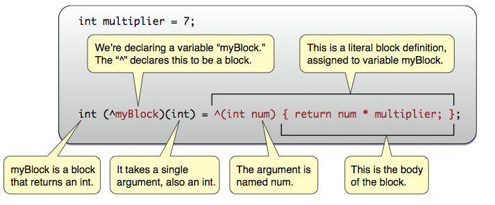

# モダンなObjective-Cプログラミング

齊藤 潤 ([@ST63Jun_](https://twitter.com/ST63Jun_))

# 自己紹介

* 齊藤 潤 ([@ST63Jun_](https://twitter.com/ST63Jun_))
* 修了間際の大学院生
* 茨城に引越しました

# Summary

* 新リテラル - NSNumberリテラル，Boxed Expression, NSArrayリテラル，NSDictionaryリテラル, 添字アクセス
* コンパイラがメモリ管理を肩代わり - ARC (Automatic Retain Count)
* Cでも無名関数 - Blocks
* マルチスレッドプログラミングを簡単に - GCD (Grand Central Dispatch)
* Bundlerライクなライブラリ管理 - CocoaPods

# はじめに

* Objective-C のプログラミング環境はどんどん良くなってる
    * コーディングを楽に
    * エンバグの軽減
* 一方、Web上の記事や書籍のコードは古いまま
* 古い情報に流されないためにも、新しいコンパイラやツールの機能を確認しておこう

# NSNumberリテラル

~~~~ { .objectivec }
void main(int argc, const char *argv[]) {
  // character literals.
  NSNumber *theLetterZ = @'Z';          // equivalent to [NSNumber numberWithChar:'Z']

  // integral literals.
  NSNumber *fortyTwo = @42;             // equivalent to [NSNumber numberWithInt:42]
  NSNumber *fortyTwoUnsigned = @42U;    // equivalent to [NSNumber numberWithUnsignedInt:42U]
  NSNumber *fortyTwoLong = @42L;        // equivalent to [NSNumber numberWithLong:42L]
  NSNumber *fortyTwoLongLong = @42LL;   // equivalent to [NSNumber numberWithLongLong:42LL]

  // floating point literals.
  NSNumber *piFloat = @3.141592654F;    // equivalent to [NSNumber numberWithFloat:3.141592654F]
  NSNumber *piDouble = @3.1415926535;   // equivalent to [NSNumber numberWithDouble:3.1415926535]

  // BOOL literals.
  NSNumber *yesNumber = @YES;           // equivalent to [NSNumber numberWithBool:YES]
  NSNumber *noNumber = @NO;             // equivalent to [NSNumber numberWithBool:NO]

#ifdef __cplusplus
  NSNumber *trueNumber = @true;         // equivalent to [NSNumber numberWithBool:(BOOL)true]
  NSNumber *falseNumber = @false;       // equivalent to [NSNumber numberWithBool:(BOOL)false]
#endif
}
~~~~

* プリミティブ型のボクシングが楽になりました

# Boxed Expression

~~~ { .objectivec }
// numbers.
NSNumber *smallestInt = @(-INT_MAX - 1);  // [NSNumber numberWithInt:(-INT_MAX - 1)]
NSNumber *piOverTwo = @(M_PI / 2);        // [NSNumber numberWithDouble:(M_PI / 2)]

// enumerated types.
typedef enum { Red, Green, Blue } Color;
NSNumber *favoriteColor = @(Green);       // [NSNumber numberWithInt:((int)Green)]
~~~

* @(...) で囲むと計算結果をボクシングすることができます

# Boxed Expression

~~~ { .objectivec }
// strings.
NSString *path = @(getenv("PATH"));       // [NSString stringWithUTF8String:(getenv("PATH"))]
NSArray *pathComponents = [path componentsSeparatedByString:@":"];
~~~

* C String -> NSString の変換もできます

# NSArray・NSDictionaryリテラル

~~~~ { .objectivec }
NSArray *elements = @[ @"H", @"He", @"O", @"C" ];
NSDictionary *masses = @{ @"H" : @1.0078,  @"He" : @4.0026, @"O" : @15.9990, @"C" : @12.0096 };
~~~~

* NSArrayやNSDictionaryの初期化が断然楽になりました

# NSArray・NSDictionaryの添字アクセス

~~~ { .objectivec }
NSMutableArray *array = ...;
NSUInteger idx = ...;
id newObject = ...;
id oldObject = array[idx];      // -> [array objectAtIndexSubscript:idx]
array[idx] = newObject;         // replace oldObject with newObject

NSMutableDictionary *dictionary = ...;
NSString *key = ...;
oldObject = dictionary[key];    // -> [dictionary objectForKeyedSubscript]
dictionary[key] = newObject;    // replace oldObject with newObject
~~~

* 添字でアクセスできます (required iOS 6+)
* objectAtIndexSubscript: or objectForKeyedSubscriptを実装すれば独自クラスでも使えます

# ARC (Automatic Reference Counting)

* これまでのObjective-Cプログラミングは苦しみに満ちていた
    * 手動メモリ管理
    * release 忘れ
        * メモリリーク
    * 二重 release
        * \> 突然の死 <

* Appleが導き出した答え
    * *ARC (Automatic Reference Counting)*
    * コンパイラがプログラマの代わりにretain, releaseするコードを書いてくれる

# ARC (Automatic Reference Counting)

~~~ { .objectivec }
{
    id obj = [NSArray alloc] init];
}
~~~

ARCが有効の場合、コンパイラが次のように書き換える

~~~ { .objectivec }
{
    id __strong obj = [NSArray alloc] init];
    [obj release];  // 変数のスコープの範囲を超えるときにreleaseされる
}
~~~

# ARCを有効にするとどうなるの

以下の制限が発生します:

* retain / release / retainCount / autorelease / dealloc が呼べない (コンパイルエラーになる)

~~~ { .objectivec }
- (void)dealloc {
     // よくあるdeallocをオーバーライドするイディオム
     [myObject release];
     [super dealloc]; // <- ARC有効の場合はコンパイルエラーになるので消す必要がある
}
~~~

* NSAutoreleasePoolオブジェクトを作成できない
    * 代わりに @autoreleasepoolブロックを使う
* (void *)とid型の暗黙的なキャストはできない
* Objective-Cのオブジェクトを構造体のメンバにできない

# ARCの注意点
コードによってはメモリリークが起こる (例：循環参照するオブジェクトの場合)

~~~ { .objectivec }
@interface MyObject : NSObject
{
    id __strong mObj;
}
- (void)setObject:(id __strong)obj;
@end
@implementation MyObject
- (id)init
{
    self = [super init];
    return self;
}
- (void)setObject:(id __strong)obj
{
    mObj = obj; // このときコンパイラは obj をretain する
}
@end
~~~ 

~~~ { .objectivec }
{
    id obj = [[MyObject alloc] init]; // -> obj.retainCount -> 1
    [obj setObject:obj];              // -> obj.retainCount -> 2
}
// スコープ終了によりコンパイラが [obj release]
// obj.release -> 1
// まだretainCountが残っている -> メモリリーク!
~~~

これは__weak修飾子を使うことで回避できる

# __weak修飾子
~~~ { .objectivec }
@interface MyObject : NSObject
{
    id __weak mObj; // __weak修飾子を指定
}
- (void)setObject:(id __strong)obj;
@end
@implementation MyObject
- (id)init
{
    self = [super init];
    return self;
}
- (void)setObject:(id __strong)obj
{
    mObj = obj; // mObjは__weak修飾付きなので、コンパイラは obj を retain *しない*
}
@end
~~~ 
~~~ { .objectivec }
{
    id obj = [[MyObject alloc] init]; // -> obj.retainCount -> 1
    [obj setObject:obj];              // -> obj.retainCount -> 1
}
// スコープ終了によりコンパイラが [obj release]
// obj.release -> 0
// [obj dealloc]が呼ばれてメモリ解放 -> All right!
~~~

# ARCのまとめ

* 自分で retain / release を書かないので楽!
    * ヒューマンエラーに起因するメモリ関連のバグも減る
* ただし万能ではない (例: 循環参照によるメモリリーク)
    * コンパイラがメモリ管理をやってくれるからといって、プログラマはそれを忘れていいわけではない
    * 参照カウントを意識すること

# Blocks

* AppleによるC言語版クロージャ
    * 実装はCなのでObjective-CだけではなくCやC++でも使える (そう、clangならね)

* Blocksを使うことでコールバック関数等の記述量が格段に減る

# Blocks以前

~~~ { .objectivec }
@interface Worker : NSObject
@end
@implementation Worker
// 処理終了後にコールバックするメソッド
- (void)somenthingToDo:(id)target delegate:(id)delegate {
    [target ...]; // 何かする
    [delegate didFinishFinishedProcess];
}
@end
~~~
~~~ { .objectivec }

// コールバック用のメソッドをわざわざ作る必要がある
- (void)didFinishFinishedProcess {
    NSLog(@"Finished!");
}

- (void)test {
    Worker *worker = [[Worker alloc] init];
    [worker somethingToDo:target delegate:self];
}
~~~

# Blocks以降
~~~ { .objectivec }
@interface Worker : NSObject
@end
@implementation Worker
// Blockを使うように変更
- (void)somenthingToDo:(id)target finished:(^callback)(void) {
    [target ...]; // 何かする
    callback();
}
@end
~~~
~~~ { .objectivec }
- (void)test {
    Worker *worker = [[Worker alloc] init];
    [worker somethingToDo:target finished:^ {
        NSLog(@"Finished!");  // 自然に記述できる!
    }];
}
~~~
コーディング量が減ったのがわかったと思います

# Blcokの構文

~~~ { .objectivec }
int multiplier = 7;
int (^myBlock)(int) = ^(int num) {
    return num * multiplier;
};
~~~

\

# 関数ポインタとの比較
~~~ { .c }
int func(int num) {
    return num * 7;
}

int main() {
    int multiplier = 7;

    // 関数ポインタ
    int (*myFuncPtr)(int) = &func;
    // Block (関数ポインタの宣言と似てる)
    int (^myBlock)(int) = ^(int num) {
       return num * multiplier;
    };

    (*myFuncPtr)(2); // -> 14
    myBlock(2);      // -> 14
}
~~~
* ただし、Blocksは関数ポインタと違い *自動変数のキャプチャができる*
* また、BlocksはObjective-Cのオブジェクトとしても使える (Toll-free bridge)

# 自動変数のキャプチャ

~~~ { .objectivec }
int multiplier = 7; // <- この時点でのmultiplierの値がBlockキャプチャされる
int (^myBlock)(int) = ^(int num) {
    return num * multiplier;  // <- multiplierの値は7
};
~~~

* Blockは外の変数の値を記憶する
    * 値は必要に応じてヒープにコピーされるので、キャプチャ元の変数のスコープを超えた場所でもアクセスできる
    * ただし、__block指定子を付けない場合は書換えはできない

~~~ { .objectivec }
int multiplier = 7; // <- この時点でのmultiplierの値がBlockキャプチャされる
int (^myBlock)(int) = ^(int num) {
    multiplier = 100;         // <- コンパイルエラー
    return num * multiplier;
};
~~~

~~~ { .objectivec }
__block int multiplier = 7; // __block指定子を付ける
int (^myBlock)(int) = ^(int num) {
    multiplier = 100;
    return num * multiplier;
};

NSLog(@"%d", multiplier); // -> 200
~~~

# GCD (Grand Central Dispatch)

* マルチスレッドプログラミングを簡単に扱うための仕組み
    * Java経験者であれば java.util.concurrentパッケージみたいなものだと言うとわかりやすいかも

* GCD以前
    * NSThreadを使う
    * NSObject#performSelectorInBackground:withObject: を使う
    * いずれもスレッドの実行順序を管理する機能がない
        * デッドロックやリソース競合に起因するバグを埋め込みやすい

* GCD以降
    * *Dispatch Queue* によってスレッドの実行順序をプログラマが制御できる
    * システム (XNUカーネル) レベルで実装されているため高速

# Dispatch Queue

~~~ { .objectivec }
// Serial Dispatch Queueを作成
dispatch_queue_t sdq = dispatch_queue_create(
    "com.example.app.MySerialDispatchQueue", NULL);

// Concurrent Dispatch Queueを作成
dispatch_queue_t cdq = dispatch_queue_create(
    "com.example.app.MyConcurrentDispatchQueue", DISPATCH_QUEUE_CONCURRENT);

// iOS 6未満ではDispatch Queueは手動でリリースする必要がある
dispatch_release(sdq);
dispatch_release(cdq);

// システムが使用するDispath Queueを取得 (RunLoopの処理に使われている)
dispatch_queue_t mdq = dispatch_get_main_queue();

// アプリケーション共用のデフォルトDispath Queueを取得
dispatch_queue_t gdq = dispatch_get_global_queue(DISPATCH_QUEUE_PRIORITY_DEFAULT, 0); // 標準の優先度のキューを取得
~~~

* 実行すべき処理を投入するキュー構造のオブジェクト
    * Serial Dispatch Queue - 一つのスレッドで順番に処理するキュー 
    * Concurrent Dispatch Queue - 複数のスレッドで並列に実行するキュー

# 処理の追加

~~~ { .objectivec }
dispatch_queue_t gdq = dispatch_get_global_queue(DISPATCH_QUEUE_PRIORITY_DEFAULT, 0);
dispatch_async(gdq, ^{
    // 並列実行する処理
});
dispatch_async(gdq, ^{
    // 一度に並列実行する数はカーネルが決定する
});
~~~

* Blocksを併用することで簡単に並列プログラミングができる!

# CocoaPods

* Rubyの[Bundler](http://gembundler.com/)ライクな機能を持つライブラリ管理ツール
* ライブラリの依存関係の解決，ダウンロード，プロジェクトへの関連付けを一気にやってくれます
     * めんどくさいライブラリ管理を簡単にすることで、プログラマの負担を軽減することができます
* インストール

    $ gem install cocoapods

    * Ruby製のツールなのでRubyの実行環境が必要です

# Podsfile

~~~ { .ruby }
    platform :ios
    pod 'Sparrow-Framework', '~> 1.4'
~~~

* プロジェクトが使用するライブラリの情報を *Podsfile*というファイルに記述します
    * Podsfileはプロジェクトディレクトリのルート (.xcodeproj) と同じ階層に設置します
    * ターミナルで pod install すると、Podsfileに記述したライブラリをダウンロードし、依存関係の関連付けを行ったワークスペースが作成されます

# まとめ

* 新リテラルによってコーディングが地味に楽に
* ARCは最高だけどメモリ管理はまだまだプログラマの責任
* Blocksでコールバックを簡潔に記述できる
* GCDはマルチスレッドプログラミングを簡単にするためのAPI
* CocoaPods便利

# おわり

* この資料を作るときに参考にした書籍・Webページ
    * [「エキスパートObjective-Cプログラミング ― iOS/OS Xのメモリ管理とマルチスレッド」 坂本一樹](http://tatsu-zine.com/books/objc)
    * [Clang Language Extensions — Clang 3.3 documentation](http://clang.llvm.org/docs/LanguageExtensions.html#objective-c-features)
    * [CocoaPods: The Objective-C Library Manager](http://cocoapods.org/)
